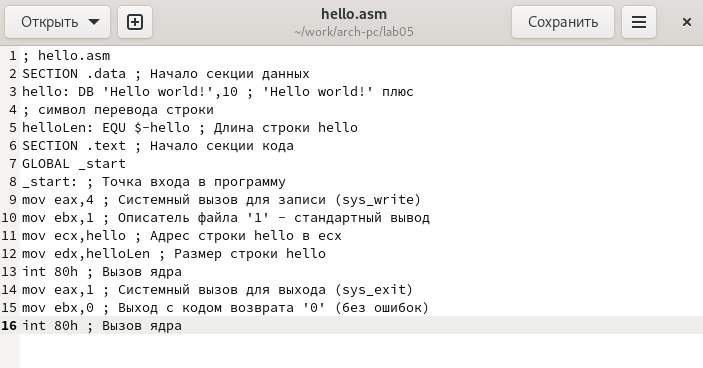
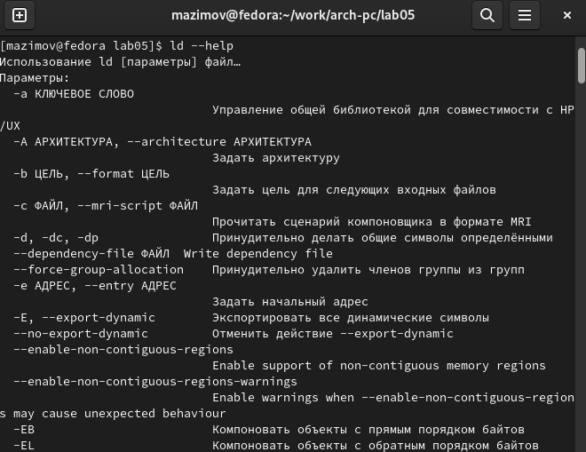
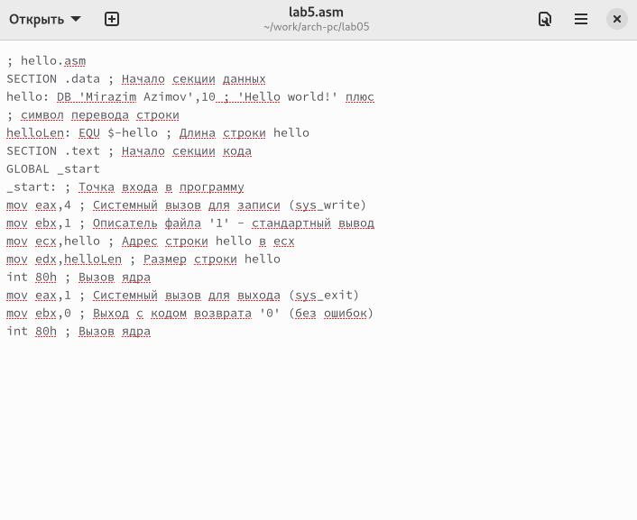
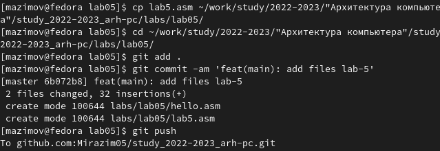

---
## Front matter
title: "Отчёт по лабораторной работе № 5"
subtitle: "Архитектура компьютера"
author: "Миразим Азимов"

## Generic otions
lang: ru-RU
toc-title: "Содержание"

## Bibliography
bibliography: bib/cite.bib
csl: pandoc/csl/gost-r-7-0-5-2008-numeric.csl

## Pdf output format
toc: true # Table of contents
toc-depth: 2
lof: true # List of figures
fontsize: 12pt
linestretch: 1.5
papersize: a4
documentclass: scrreprt
## I18n polyglossia
polyglossia-lang:
  name: russian
  options:
	- spelling=modern
	- babelshorthands=true
polyglossia-otherlangs:
  name: english
## I18n babel
babel-lang: russian
babel-otherlangs: english
## Fonts
mainfont: PT Serif
romanfont: PT Serif
sansfont: PT Sans
monofont: PT Mono
mainfontoptions: Ligatures=TeX
romanfontoptions: Ligatures=TeX
sansfontoptions: Ligatures=TeX,Scale=MatchLowercase
monofontoptions: Scale=MatchLowercase,Scale=0.9
## Biblatex
biblatex: true
biblio-style: "gost-numeric"
biblatexoptions:
  - parentracker=true
  - backend=biber
  - hyperref=auto
  - language=auto
  - autolang=other*
  - citestyle=gost-numeric
## Pandoc-crossref LaTeX customization
figureTitle: "Рис."
tableTitle: "Таблица"
listingTitle: "Листинг"
lofTitle: "Список иллюстраций"
lolTitle: "Листинги"
## Misc options
indent: true
header-includes:
  - \usepackage{indentfirst}
  - \usepackage{float} # keep figures where there are in the text
  - \floatplacement{figure}{H} # keep figures where there are in the text
---

# Цель работы

Освоение процедуры компиляции и сборки программ, написанных на, машинноориентированный языке низкого уровня, ассемблере NASM.

# Задание

1. Создать файлы расширения .asm.
2. Отредактировать .asm файлы.
3. Оттранслировать .asm файлы в объектные.
4. С помощью компановщика создать исполняемые файлы и запустить.

# Выполнение лабораторной работы

## Программа Hello world!

Рассмотрели пример простой программы на языке ассемблера NASM. Традиционно первая программа выводит приветственное сообщение Hello world! на экран.
Создали каталог для работы с программами на языке ассемблера NASM: (рис. [-@fig:001])

{ #fig:001 width=70% }

Перешли в созданный каталог. (рис. [-@fig:002])

{ #fig:002 width=70% }

Создали текстовый файл с именем hello.asm.
Открыли этот файл с помощью текстового редактора gedit. 
Введите в него следующий текст: (рис. [-@fig:003])

{ #fig:003 width=70% }

##  Транслятор NASM

NASM превращает текст программы в объектный код. Для компиляции текста
 программы «Hello World» написали: (рис. [-@fig:004])

{ #fig:004 width=70% }

 С помощью транслятора преобразовали текст программы из файла hello.asm в объектный код, 
 который записали в файл hello.o С помощью команды ls проверили, что объектный файл был создан. Объектный
 файл имеет имя hello.o (рис. [-@fig:006])

{ #fig:006 width=70% }

## Расширенный синтаксис командной строки NASM

Выполнили следующую команду: (рис. [-@fig:007])

{ #fig:007 width=70% }

Данная команда скомпилирует исходный файл hello.asm в obj.o (опция -
o позволяет задать имя объектного файла, в данном случае obj.o), при этом
формат выходного файла будет elf, и в него будут включены символы для
отладки (опция -g), кроме того, будет создан файл листинга list.lst (опция
-l).

С помощью команды ls проверьте, что файлы были созданы. (рис. [-@fig:008])

{ #fig:008 width=70% }

## Компоновщик LD

Для получения исполняемой программы,
объектный файл передали на обработку компоновщику: (рис. [-@fig:009])

{ #fig:009 width=70% }

С помощью команды ls проверьте, что исполняемый файл hello был создан. (рис. [-@fig:010])

{ #fig:010 width=70% }

Выполните следующую команду: (рис. [-@fig:011])

{ #fig:011 width=70% }

Исполняемый файл будет иметь имя main. Объектный файл,
из которого собран этот исполняемый файл, будет иметь имя main.о (рис. [-@fig:012])

{ #fig:012 width=70% }

Формат командной строки LD увидели, набрав ld --help. (рис. [-@fig:013])

{ #fig:013 width=70% }

## Запуск исполняемого файла

Запустили на выполнение созданный исполняемый файл, находящийся в
текущем каталоге. (рис. [-@fig:014])

{ #fig:014 width=70% }

## Задание для самостоятельной работы

1. В каталоге ~/work/arch-pc/lab05 с помощью команды cp создали копию
файла hello.asm с именем lab5.asm (рис. [-@fig:015]), (рис. [-@fig:016])

{ #fig:015 width=70% }

{ #fig:016 width=70% }

2. С помощью текстового редактора внесли изменения в текст программы в файле lab5.asm так, чтобы вместо Hello world! на экран выводилась строка с фамилией и именем. (рис. [-@fig:017])

{ #fig:017 width=70% }

3. Оттранслировали полученный текст программы lab5.asm в объектный
файл. (рис. [-@fig:018])

{ #fig:018 width=70% }

 Выполнили компоновку объектного файла и запустили получившийся исполняемый файл.
 (рис. [-@fig:019]), (рис. [-@fig:020])
 
 { #fig:019 width=70% }
 
 { #fig:020 width=70% }
 
4. Скопируйте файлы hello.asm и lab5.asm в Ваш локальный репозиторий
в каталог ~/work/study/2022-2023/"Архитектура компьютера"/archpc/labs/lab05/. 
(рис. [-@fig:021]), (рис. [-@fig:022])

{ #fig:021 width=70% }

{ #fig:022 width=70% }

Загрузите файлы на Github. (рис. [-@fig:023])

{ #fig:023 width=70% }

# Выводы

В ходе лабораторной работы были освоены процедуры компиляции и сборки программ, написанных на машинноориентированном языке низкого уровня, ассемблере NASM.

::: {#refs}
:::
